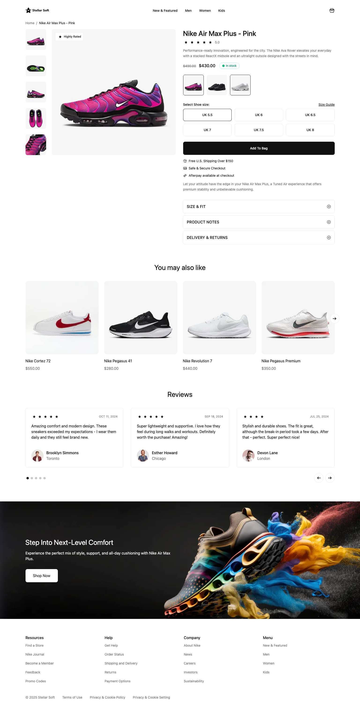

# Shopify Product Detail Page - Skeleton Theme

Повноцінна **Product Detail Page (PDP)** на основі **Shopify Skeleton Theme**, розроблена згідно з вимогами фінального практичного завдання Shopify-школи. Production-ready рішення для реальних клієнтських проєктів.

## Посилання

- **Dev Store:** [skeleton-theme-780.myshopify.com](https://skeleton-theme-780.myshopify.com/)  
  Пароль: `menoth`

- **GitHub:** [github.com/ViktorSvertoka/skeleton-theme](https://github.com/ViktorSvertoka/skeleton-theme)

- **Figma Design:** [Test for Developer - PDP](https://www.figma.com/design/OE4IxavDCK3dSAPxcXz29f/Test-for-Developer--PDP-)

## Швидкий старт

### Вимоги

- Node.js v18+
- Shopify CLI
- Доступ до dev-store

### Встановлення та запуск

```bash
# Клонувати репозиторій
git clone https://github.com/ViktorSvertoka/skeleton-theme.git

# Перейти в директорію проєкту
cd skeleton-theme

# Авторизуватися в Shopify CLI
shopify login

# Запустити тему в режимі розробки
shopify theme dev
```

Після запуску відкрийте локальний preview або dev-store, згенерований Shopify CLI.

## Реалізований функціонал

### 1. Основний блок продукту

- Назва продукту
- Ціна та `compare_at_price`
- Вибір варіантів:
  - Size (через варіанти продукту)
  - Color (через метафілди та пов'язані продукти)
- Селектор кількості
- Кнопка "Add to Cart" (окремий snippet)
- SKU та Vendor
- Галерея зображень з прев'ю
- Динамічні бейджі (залежать від тегів)
- Динамічне оновлення ціни при зміні варіанта
- Підтримка color schemes
- Налаштування через Theme Editor
- Коректна форма ``

### 2. Аккордеон "Опис / Доставка / Повернення"

**Секція:** `product-accordion.liquid`

- Дані з метафілдів:
  - `product.metafields.custom.size_fit`
  - `product.metafields.custom.product_notes`
  - `product.metafields.custom.returns_policy`
- Власна JS-логіка відкриття/закриття
- ARIA-атрибути для доступності

### 3. Блок відгуків

- Реалізовано через `product.metafields.custom.reviews_json`
- Відображення:
  - Рейтинг (зірки)
  - Ім'я користувача
  - Текст відгуку
  - Дата
- Демонстраційні дані

### 4. Рекомендовані товари ("You may also like")

- Інтеграція з Search & Discovery app
- Вибір колекції через налаштування секції
- Максимум 4 товари
- Окремий snippet для картки продукту
- Lazy-load зображень

### 5. Банер з CTA

Кастомна секція з повним налаштуванням через Theme Editor:

- Зображення
- Текст
- Кнопка

## JavaScript функціонал

- Перемикання варіантів продукту
- Динамічне оновлення ціни
- Логіка аккордеону
- Обробка submit форми продукту
- Обробка помилок недоступних варіантів
- Показ зображення при виборі кольору

## Доступність (A11y)

- Коректні `alt`-теги
- `aria-expanded`, `aria-controls`
- Підтримка навігації з клавіатури
- `aria-live` для динамічних оновлень

## Продуктивність

- Lazy-loading зображень
- Коректні розміри зображень
- `fetchpriority="high"` для головного фото

## Метафілди

### Product Metafields

```
custom.color
custom.related_colors
custom.size_fit
custom.product_notes
custom.returns_policy
custom.reviews_json
custom.size_guide (reference на metaobject)
```

### Metaobjects

**Size Guide**

- Реалізовано через Metaobject
- Дані таблиці з адмін-панелі
- Прив'язка до продукту через metafield
- Modal для desktop + mobile

## Додаткові фічі

- **Product Stock Indicator** (In stock / Low stock / Running out / Out of stock)
- **Size Guide modal** на основі metaobject
- **Показ зображення варіанта** при виборі кольору

## Результат

Реалізована PDP-сторінка:

- Відповідає дизайну Figma
- Побудована на Skeleton Theme
- Використовує сучасні Shopify best practices
- Доступна, продуктивна та масштабована
- Готова для використання у реальних клієнтських проєктах


